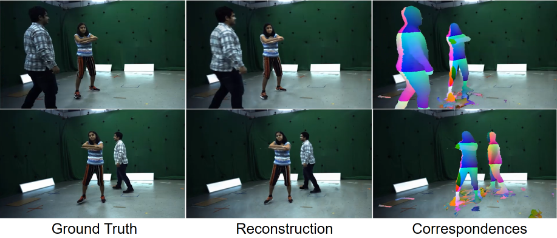

# SceNeRFlow

This is the official code release for *SceNeRFlow: Time-Consistent Reconstruction of General Dynamic Scenes* (3DV 2024), a NeRF-based method to reconstruct a general, non-rigid scene in a time-consistent manner, including large motion. This work was done by Edith Tretschk, Vladislav Golyanik, Michael Zollhöfer, Aljaž Božič, Christoph Lassner, and Christian Theobalt.
[[Project Page]](https://vcai.mpi-inf.mpg.de/projects/scenerflow/) [[ArXiv]](https://arxiv.org/abs/2308.08258)



* [Installation](https://github.com/facebookresearch/SceNeRFlow#installation)
* [Run on a Scene](https://github.com/facebookresearch/SceNeRFlow#run-on-a-scene)
    - [Input Format](https://github.com/facebookresearch/SceNeRFlow#input-format)
    - [Input Conversion](https://github.com/facebookresearch/SceNeRFlow#input-conversion)
    - [Reconstruction](https://github.com/facebookresearch/SceNeRFlow#reconstruction)
    - [Rendering](https://github.com/facebookresearch/SceNeRFlow#rendering)
    - [Evaluation](https://github.com/facebookresearch/SceNeRFlow#evaluation)
* [Special Features](https://github.com/facebookresearch/SceNeRFlow#special-features)
* [Other Methods](https://github.com/facebookresearch/SceNeRFlow#other-methods)
    - [Instructions for SNF-A, SNF-AG](https://github.com/facebookresearch/SceNeRFlow#instructions-for-snf-a-snf-ag)
    - [Instructions for Ablations](https://github.com/facebookresearch/SceNeRFlow#instructions-for-ablations)
    - [Instructions for Re-Implementations of PREF, NR-NeRF, and D-NeRF](https://github.com/facebookresearch/SceNeRFlow#instructions-for-re-implementations-of-pref-nr-nerf-and-d-nerf)
* [Citation](https://github.com/facebookresearch/SceNeRFlow#citation)
* [License](https://github.com/facebookresearch/SceNeRFlow#license)

## Installation

1) Install [Miniconda](https://docs.conda.io/projects/miniconda/en/latest/) (this repository is tested with version 23.9.0)
2) Clone this repository: `git clone https://github.com/facebookresearch/SceNeRFlow`
3) Navigate into the root directory: `cd SceNeRFlow`
4) Create the environment: `conda env create -f environment.yml`
5) Activate the environment: `conda activate snf`
6) Install further dependencies: `pip install -r requirements.txt`
7) Install [tiny-cuda-nn](https://github.com/NVlabs/tiny-cuda-nn):
* `git clone --recursive https://github.com/nvlabs/tiny-cuda-nn`
* `cd tiny-cuda-nn`
* `git checkout 9a17f05`
* in `include/tiny-cuda-nn/encodings/grid.h`: uncomment "case 1" in `create_grid_encoding_templated`
* in `include/tiny-cuda-nn/common.h`: replace `#define TCNN_HALF_PRECISION (!(TCNN_MIN_GPU_ARCH == 61 || TCNN_MIN_GPU_ARCH <= 52))` with `#define TCNN_HALF_PRECISION 0`
* in tiny-cuda-nn's root directory, run `cmake . -B build -DCMAKE_CUDA_COMPILER=/usr/lib/cuda-11.3/bin/nvcc && cd build && cmake --build . --config RelWithDebInfo -j && cd ../bindings/torch/ && python setup.py install`

## Run on a Scene

If you want to try out the code with an existing scene, a short sequence compatible with this codebase is available [here](https://4dqv.mpi-inf.mpg.de/data/synthetic_scene.zip.zip).

If you use this scene, please set `weight_hard_surface_loss = 100` in `configs/default.txt` rather than the default `weight_hard_surface_loss = 1` like the scenes in the paper. (See below for how to set this weight in general.)

### Config File

Adapt `datadir` and `expname` in `configs/default.txt`.

The test cameras (used only for test-time rendering) are specified via their extrinsic names as `test_cameras = ['some_cam', 'another_cam']` (to specify test images freely, change `self.test_imageids = ...` in `data_loader_blender.py`).

In general, `weight_hard_surface_loss` can be determined as follows: Look at the renderings of the canonical model (i.e. of the first timestep, after 20k training iterations) in the `1_renderings` subfolder. If the dynamic foreground disappears, keep decreasing this weight by a factor of 3 until this first rendering looks reasonable. If the dynamic foreground turns into a large cloud without a recognizable surface, keep increasing by a factor of 3.

### Input Format

The method takes as input multi-view RGB images with extrinsics, intrinsics, near and far planes, synchronized timestamps, and background images.

_Images_: The `images` folder contains the multi-view RGB images, while `background` contains the background images. The images in `images` and in `background` can be named arbitrarily.

_Associations_: The images in `images` are associated with their extrinsics, intrinsics, and timestamps in `frame_to_extrin_intrin_time.json`. The names of the extrinsic and intrinsic cameras (e.g. `StaticCamera.001`) can be arbitrary. Furthermore, the background images are associated with extrinsics and intrinsics in `background_to_extrin_intrin.json`.

_Extrinsics_: The camera extrinsic translation is the position of the camera in world space. The same unit of length is also used for the near and far plane values. The camera extrinsic rotation is camera-to-world, `R * c = w`. The camera coordinate system has the x-axis pointing to the right, y up, and z back.

_Intrinsics_: The intrinsics use pixel units. The distortion parameters (k1, k2, p1, p2, k3, s1, s2, s3, s4) follow the OpenCV definitions. The codebase handles distortions by iteratively optimizing for undistorted ray directions for each pixel in the distorted image (thanks [Nerfies](https://github.com/google/nerfies)). This is experimental and prone to divergence. If this happens, consider to instead provide undistorted images and to set all distortion parameters in `intrinsics.json` to zeros.

### Input Conversion

To convert the image files into the custom dataset format used by this codebase, run the following command:
```
python preprocess.py ./SOME_INPUT_SCENE_FOLDER
```
A different output folder can be used as well: `python preprocess.py ./SOME_INPUT_SCENE_FOLDER ./SOME_OTHER_FOLDER`. Make sure to enter the new output folder in the config file under `datadir`.

_Pruning_: Setting `debug = True` in `_space_carving()` will output the voxel grids that are used at each timestep as `.obj` point clouds and thereby allows to check whether the voxel grids are plausible. If the dataset is an outside-in 360° camera setup like in a studio or light stage where the entire foreground lies inside the bounding box spanned by the cameras, also try to replace both occurences of `studio_bounding_box = False` with `studio_bounding_box = True` in `_space_carving()` for a nicer voxel grid for pruning.

### Reconstruction

To train the reconstruction, use:
```
python train.py --config ./configs/default.txt --no_reload
```
The results will be in `./results/SOME_EXPERIMENT_NAME`, where `SOME_EXPERIMENT_NAME` is `expname` in `config.txt`.

_Note_: (1) To continue an interrupted training, remove the `--no_reload` flag. (2) Training creates a lot of large files, namely a few hundred MBs per timestep in the scene.

### Rendering

To render into the test cameras:
```
python rendering.py ./results/SOME_EXPERIMENT_NAME
```
The results will be in `./results/SOME_EXPERIMENT_NAME/4_outputs`

_Circular_: It is also possible to render an inward-facing circular trajectory:
```
python rendering.py ./results/SOME_EXPERIMENT_NAME --circular
```
The parameters of the circular rendering are at the top of `test_time_rendering_circular()`, before `output_folder = ...`. The path of the circular trajectory is defined in `get_circular_trajectory()`. This functions uses `mode = ...` to specify whether the y-axis or z-axis is the vertical axis.

_Editing_: Several basic geometry and appearance editing tasks in the canonical space can be done. To this end, please refer to `_editing()` in `rendering.py`. In the code, joints and their surroundings are used as regions to modify. Specifically, the lines below `MODIFY HERE` in `_editing()` offer multiple different editing possiblities in a `radius` around any joint. To provide the joints as input, create a file `joints.json` in the root directory of the dataset, e.g. `./INPUT_SCENE_FOLDER/joints.json`. The content of `joints.json` should be structured as follows:
```
{
    "0": { # person id, starting from 0
            "0": { # joint id, starting from 0
                "joint_name": "top_of_head", # joint name
                "joint_position": [ # joint position in world space at t=0
                    [
                        2392.63,
                        1658.34,
                        -231.905
                    ]
                  },
            ... # more joints
          }
     ... # more people
}
```
Editing is turned off by default. To turn it on, set `do_edit = True` at the beginning of either `test_time_rendering_circular()` or `test_time_rendering_test_cameras()`. Note that instead of joint positions, any arbitrary location in canonical space can also easily be used inside `_editing()`; joints are just easier to determine as an input to that function.

### Evaluation

To evaluate the (unmasked) test images, use:
```
python evaluation.py ./results/SOME_EXPERIMENT_NAME
```
The results will be in `./results/SOME_EXPERIMENT_NAME/4_outputs/novel_view_eval`. All test images will be rendered from scratch. The images from `rendering.py` or from training are not re-used. See `quantitative_evaluation_novel_views()` before `output_folder = ...` for further settings.

_Masked_: The paper also uses masked evaluation. The code allows for this with `python evaluation.py ./results/SOME_EXPERIMENT_NAME --masked`. The masks are generated with a simple thresholding technique, see the supplementary material for details. The parameters of this thresholding need to be adjusted per scene. This can be done at the beginning of `quantitative_evaluation_novel_views()`.

_LPIPS_: To enable LPIPS evaluation, install [LPIPS](https://github.com/richzhang/PerceptualSimilarity):
```
pip install lpips
```

## Special Features

* _Automatic batch splitting_: The code adaptively determines a virtual batch size, such that any batch size should fit into limited GPU memory. See `trainer.py` for details.
* _Robustness to interruption_: The code is robust to being split into short-term server jobs. The results in the paper were obtained by chaining one-hour jobs. The first job needs to have `no_reload = True`, while all follow-up jobs need to have `no_reload = False`. (Note that command line flags take precedence over flags in the config file.) See `state_loader_saver.py` for details.
* _Fast dataset format_: The code uses a basic custom dataset format to allow for fast random access without querying the filesystem. Ideal for clusters with shared filesystem. See `binary_dataset.py` for details.
* _Experimental multi-GPU support_: The code should be able to use multiple GPUs. However, this feature was never tested. See `multi_gpu.py` for details and all references to it.

## Other Methods

The following other methods have not been tested with the cleaned code in this repository. However, they should still work since they did work with the original code used in the paper.

### Instructions for SNF-A, SNF-AG

In addition to a time-invariant canonical model, the paper also present variants that allow for the appearance to change (SNF-A) or for both appearance and geometry to change (SNF-AG). Please refer to the paper and the supplementary material for details.

These variants can be trained by setting `variant = snfa` or `variant = snfag`.

### Instructions for Ablations

The ablations in the paper can be obtained as follows:

* _Online optimization_: `tracking_mode = plain` and `optimization_mode = all`
* _Extending the deformation field_: in `losses.py`, set `max_windowed=False` and `smart_maxpool=False` everywhere in `compute()`; in `deformation_model_ngp.py`, set `self.hash_encoding_config["base_resolution"] = 512`
* _Coarse deformations_: `weight_coarse_smooth_deformations = 30`
* _Fine deformations_: at the beginning of `test_time_rendering_test_cameras()` of `rendering.py`, set `only_coarse = True`

### Instructions for Re-Implementations of PREF, NR-NeRF, and D-NeRF

Before using these re-implementations, please see the supplementary material of SceNeRFlow for which modifications were made to the original methods.

If these modifications are acceptable for your use case, you can set `do_dnerf = True` in the config file for [D-NeRF](https://www.albertpumarola.com/research/D-NeRF/index.html) or `do_nrnerf = True` for [NR-NeRF](https://vcai.mpi-inf.mpg.de/projects/nonrigid_nerf/). See the bottom of `train.py` for what happens internally when setting these flags.

For [PREF](https://lsongx.github.io/projects/pref.html), in addition to setting `do_pref = True`, multiple independent trainings need to be run because PREF splits the scene into temporal windows. First, start a training with `pref_dataset_index = 0`. Then, start another training with `pref_dataset_index = 1`, another one with `2` etc., until the latest one throws an error that the dataset is not that large.

## Citation

```
@inproceedings{tretschk2024scenerflow,
    title = {SceNeRFlow: Time-Consistent Reconstruction of General Dynamic Scenes},
    author = {Tretschk, Edith and Golyanik, Vladislav and Zollh\"{o}fer, Michael and Bozic, Aljaz and Lassner, Christoph and Theobalt, Christian},
    year = {2024},
    booktitle={International Conference on 3D Vision (3DV)},
}
```

## License

This repository is released under a CC-BY-NC 4.0 license, please refer to the `LICENSE` file for details.

Several functions in `utils.py` are modified versions from the [FFJORD codebase](https://github.com/rtqichen/ffjord). The modified AdamW implementation in `smart_adam.py` is based on PyTorch's Adam implementation. The volumetric rendering in `renderer.py` is based on Yen-Chen Lin's [NeRF code](https://github.com/yenchenlin/nerf-pytorch), which in turn is based on the [original NeRF code](https://github.com/bmild/nerf). The iterative optimization in `ray_builder.py` is inspired by code from [Nerfies](https://github.com/google/nerfies). We thank all of them for releasing their code.
